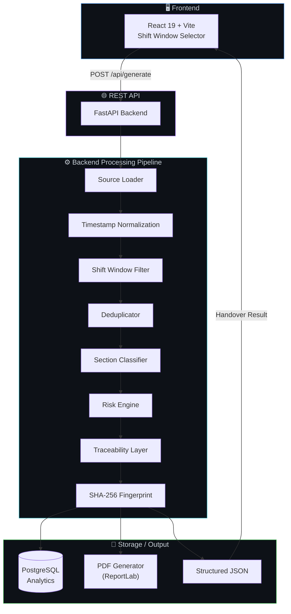
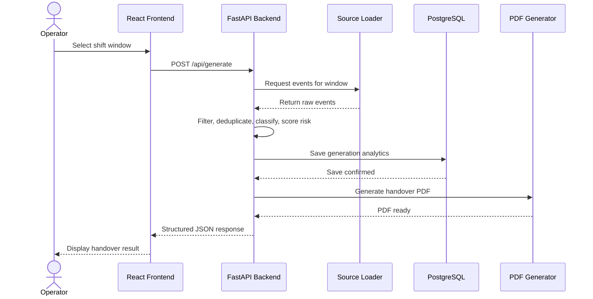
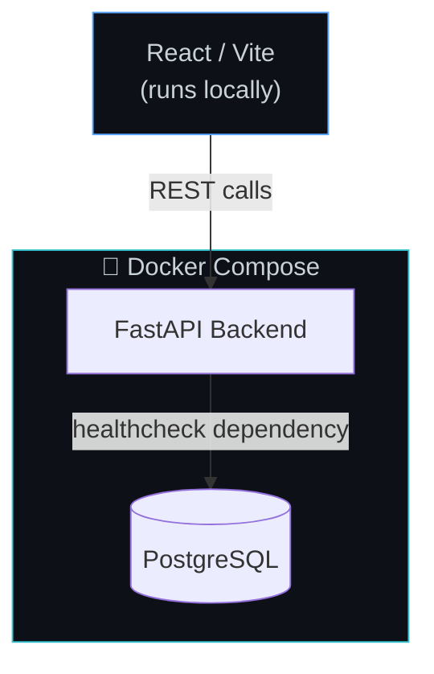

<p align="center">
  
</p>
<!-- Add screenshot to docs/images/banner.png -->

<h1 align="center">ShiftSync AI</h1>

<p align="center">
  <strong>Intelligent Shift Handover Generator</strong>
</p>

<p align="center">
  From raw operational activity to grounded, traceable, and actionable shift handovers.
</p>

<p align="center">
  
  
  
  
  
  
  
  
</p>

<p align="center">
  Select a shift. ShiftSync filters real operational activity, removes duplicate updates, identifies risks, builds a traceable four-section handover, stores analytics in PostgreSQL, and generates a downloadable PDF.
</p>

<p align="center">
  <a href="#-application-preview">Preview</a> •
  <a href="#-key-features">Features</a> •
  <a href="#-verified-demo-result">Verified Demo</a> •
  <a href="#-architecture">Architecture</a> •
  <a href="#-api-reference">API</a> •
  <a href="#-getting-started">Getting Started</a> •
  <a href="#-roadmap">Roadmap</a>
</p>

---

## 🖥️ Application Preview

<table>
<tr>
<td width="50%">
  
  <!-- Add screenshot to docs/images/dashboard.png -->
  <p align="center"><em>Dashboard — shift window selection (date, start, end, timezone)</em></p>
</td>
<td width="50%">
  
  <!-- Add screenshot to docs/images/generate-handover.png -->
  <p align="center"><em>Generating a handover from live shift activity</em></p>
</td>
</tr>
<tr>
<td width="50%">
  
  <!-- Add screenshot to docs/images/handover-result.png -->
  <p align="center"><em>Structured four-section handover output</em></p>
</td>
<td width="50%">
  
  <!-- Add screenshot to docs/images/pdf-report.png -->
  <p align="center"><em>Exported PDF handover report</em></p>
</td>
</tr>
</table>

---

## 📌 The Problem

Operational teams working in shifts constantly need to hand off context about completed work, ongoing tasks, incidents, blockers, risks, and items requiring monitoring.

Manual handover notes are:

- **Slow** — written under time pressure at the end of a shift
- **Inconsistent** — format and detail vary by author
- **Repetitive** — the same information gets re-typed from tickets and incident tools
- **Hard to verify** — no traceability back to the source system

## 💡 The Solution

**ShiftSync AI** converts raw operational shift activity into a structured, grounded, and traceable shift handover — automatically.

An operator selects a bounded shift window:

```
Date:        03 September 2026
Start Time:  05:00 PM
End Time:    08:00 PM
Timezone:    IST (UTC+5:30)
```

The frontend sends this window to a FastAPI backend, which loads operational records, normalizes timestamps, filters strictly to the shift window, removes duplicates, classifies activity into four sections, scores risk, attaches source traceability, fingerprints the result, persists analytics to PostgreSQL, and generates a downloadable PDF — returning everything as structured JSON to the React frontend.

---

## ✨ Key Features

### 1. Shift Window Selection
Operators define a bounded operational shift. Every event is filtered using a strict, deterministic rule:

```
shift_start <= event_timestamp < shift_end
```

Only events inside this window are ever processed.

### 2. Multi-Source Operational Data
The current prototype uses **realistically seeded ticketing and incident data**. The architecture is designed to extend to additional sources — Jira, GitHub, Slack, ServiceNow, Microsoft Teams, PagerDuty, Grafana, and Prometheus — but **these integrations do not exist yet and are tracked under [Roadmap](#-roadmap)**.

### 3. Deduplication
Operational systems often produce multiple updates for the same record. ShiftSync groups records by `(source, record_id)` and retains only the latest relevant update.

```
OPS-1001 @ 17:15 → Open
OPS-1001 @ 18:20 → Resolved
─────────────────────────────
Final handover → OPS-1001, Resolved (latest wins)
```

### 4. Four Handover Sections
Every record is classified into exactly one section:

| Section | Meaning |
|---|---|
| ✅ Completed | Work finished during the shift |
| 🔄 In Progress | Ongoing, unresolved work |
| 🚨 Blockers | Escalated or failed items needing attention |
| 👀 Watch-list | Items to monitor, not yet critical |

If a section has no matching records, it explicitly states **"Nothing to report."** The system never fabricates an item.

### 5. Full Traceability
Every generated item carries a complete audit trail:

`source` · `record ID` · `timestamp` · `summary` · `status` · `severity` · `owner` · `section` · `risk score` · `risk level` · `source reference`

### 6. Deterministic Risk Engine
See [Risk Engine](#-risk-engine) below for the full scoring model.

### 7. Reproducibility Fingerprint
A **SHA-256 fingerprint** is generated from the shift window plus the generated handover sections, allowing anyone to verify that a handover was produced deterministically from the same inputs.

### 8. PostgreSQL Analytics
Every generation run persists shift metadata for later analysis — see [Database](#-database).

### 9. PDF Export
A structured PDF handover is generated with ReportLab via `GET /api/export`.

### 10. Source Health Reporting
The backend reports the connectivity status of each configured source, e.g. `ticketing → connected`, `incidents → connected`.

---

## ✅ Verified Demo Result

> The following results were generated and observed against a running instance of ShiftSync AI. They are shown here as **verified**, not illustrative.

**Demo shift window:** `03 September 2026, 17:00 → 20:00 IST`

<div align="center">

| 📥 Events Scanned | 🪟 Inside Shift | 🔑 Unique Records | 🧹 Duplicates Removed |
|:---:|:---:|:---:|:---:|
| **7** | **5** | **4** | **1** |

</div>

### Generated Handover

| Section | Record | Description | Owner | Risk |
|---|---|---|---|---|
| ✅ Completed | `OPS-1001` | Password reset issue resolved | support-team | 🟢 Low |
| 🔄 In Progress | `INC-201` | Authentication API latency increased | backend-team | 🟠 High |
| 🚨 Blocker | `OPS-1002` | Mobile login failures reported | Unassigned | 🔴 Critical |
| 👀 Watch-list | `INC-202` | Database connection pool nearing limit | platform-team | 🟡 Medium |

Database persistence was also verified — the run was saved with `database.saved = true`, and the corresponding row was confirmed in the PostgreSQL `generated_handovers` table.

---

## 🏗️ Architecture



### Processing Pipeline (simplified)


### Request Sequence



---

## 🧰 Tech Stack

<table>
<tr>
<td valign="top" width="25%">

**Frontend**
- React 19
- Vite
- JavaScript
- Tailwind CSS
- React Router
- Lucide React
- Recharts

</td>
<td valign="top" width="25%">

**Backend**
- Python
- FastAPI
- Pydantic
- Uvicorn
- python-dateutil
- ReportLab
- SQLAlchemy

</td>
<td valign="top" width="25%">

**Database & DevOps**
- PostgreSQL 17
- Docker
- Docker Compose

</td>
<td valign="top" width="25%">

**Analytics & VCS**
- Jupyter Notebook
- Power BI–ready structure
- Git / GitHub

</td>
</tr>
</table>

---

## ⚠️ Risk Engine

Each record's risk score is computed deterministically from its severity and status:

**Base severity**

| Severity | Points |
|---|---:|
| Low | 1 |
| Medium | 2 |
| High | 3 |
| Critical | 4 |

**Status modifiers**

| Condition | Points |
|---|---:|
| Blocked / Escalated / Failed | +3 |
| Investigating / In Progress | +2 |
| Open / Watch | +1 |
| No Owner | +2 |

**Resulting risk level**

| Total Score | Risk Level |
|---:|---|
| ≥ 7 | 🔴 Critical |
| ≥ 5 | 🟠 High |
| ≥ 3 | 🟡 Medium |
| < 3 | 🟢 Low |

---

## 🔍 Grounding & Traceability

Every item in a generated handover is fully traceable back to its origin. Nothing is summarized away or invented — each record retains its `source`, `record ID`, `timestamp`, `owner`, and `source reference` alongside its classification and risk score, so any claim in a handover can be checked against the underlying operational record.

---

## 🧠 Why Deterministic Instead of LLM-First?

Shift handovers are **operations-sensitive**. An incorrect or hallucinated statement in a handover can cause a missed incident, an unassigned blocker, or a false sense of resolution — the cost of being wrong is high, and the cost of being untraceable is nearly as high.

For that reason, ShiftSync AI's core generation engine is **fully deterministic**, built on explicit rules rather than free-form generation:

- **Grounding** — every output item maps to a real source record
- **Traceability** — every item can be traced back to its source and timestamp
- **Determinism** — the same inputs always produce the same handover
- **Reproducibility** — verified via a SHA-256 fingerprint of the shift window and output
- **No hallucination** — if there is nothing to report, the system says so; it never invents an item

An LLM can be introduced later as an **optional summarization layer** on top of the deterministic pipeline — but it would only be permitted to rephrase or condense records that already passed through the grounded pipeline, never to originate new claims. This is currently listed under [Roadmap](#-roadmap) and does not exist in the current build.

---

## 📡 API Reference

<details>
<summary><strong>GET /api/health</strong> — service liveness check</summary>

Returns backend service status.
</details>

<details>
<summary><strong>GET /api/database-health</strong> — database connectivity check</summary>

Returns PostgreSQL connection status.
</details>

<details>
<summary><strong>POST /api/generate</strong> — generate a shift handover</summary>

**Request body**

```json
{
  "shift_start": "2026-09-03T17:00:00+05:30",
  "shift_end": "2026-09-03T20:00:00+05:30"
}
```

**Response**

```json
{
  "shift": { "...": "shift window details" },
  "metrics": { "...": "events scanned, in-window, unique, duplicates" },
  "source_health": { "ticketing": "connected", "incidents": "connected" },
  "sections": { "completed": [], "in_progress": [], "blockers": [], "watch_list": [] },
  "fingerprint": "sha256:...",
  "pdf": { "...": "export details" },
  "database": { "saved": true }
}
```
</details>

<details>
<summary><strong>GET /api/export</strong> — download the generated PDF</summary>

Returns the ReportLab-generated PDF handover for the most recent (or specified) generation.
</details>

Full interactive documentation is available via Swagger once the backend is running: `http://localhost:8000/docs`

---

## 🗄️ Database

Every generation run is persisted to a `generated_handovers` table in PostgreSQL, storing the shift window, fingerprint, and processing metrics.

**Verify persisted runs:**

```bash
docker exec -it shiftsync-database psql -U postgres -d shiftsync
```

```sql
SELECT
    id,
    shift_start,
    shift_end,
    events_scanned,
    events_in_window,
    unique_records,
    duplicates_removed
FROM generated_handovers
ORDER BY id DESC
LIMIT 5;
```

> **Note:** PostgreSQL may display IST-entered timestamps as their equivalent UTC value. This is expected timezone normalization, not a data error.

---

## 📄 PDF Export

The backend generates a structured PDF handover using **ReportLab** via `GET /api/export`, mirroring the sections and traceability data of the JSON response for offline sharing or archival.

<p align="center">
  
</p>
<!-- Add screenshot to docs/images/pdf-report.png -->

---

## 📁 Project Structure

```
RISE-RST/
│
├── README.md
├── REPORT.md
├── requirements.txt
├── docker-compose.yml
│
├── backend/
│   ├── Dockerfile
│   ├── app/
│   │   ├── main.py
│   │   ├── schemas.py
│   │   ├── database.py
│   │   ├── models.py
│   │   ├── routers/
│   │   └── services/
│   ├── data/
│   ├── generated/
│   └── tests/
│
├── frontend/
│   ├── package.json
│   ├── vite.config.js
│   └── src/
│       ├── components/
│       ├── pages/
│       ├── services/
│       │   └── api.js
│       ├── data/
│       └── utils/
│
├── database/
│   ├── init.sql
│   └── seed.sql
│
└── analytics/
    ├── notebooks/
    │   └── shift_analysis.ipynb
    └── powerbi/
        └── README.md
```

---

## 🚀 Getting Started

### 1. Clone the repository

```bash
git clone https://github.com/JOSHIKA1207/RISE-RST.git
cd RISE-RST
```

### 2. Start backend + database with Docker

```bash
docker compose up --build
```



The **FastAPI backend** only starts serving once the **PostgreSQL healthcheck** passes, ensuring the database is ready before the API accepts requests.

### 3. Backend & API docs

- Backend: `http://localhost:8000`
- Swagger UI: `http://localhost:8000/docs`

### 4. Run the frontend

```bash
cd frontend
npm install
npm run dev
```

Open: `http://localhost:5173`

### 5. Try the verified demo shift

```
Date:  03 September 2026
Start: 05:00 PM
End:   08:00 PM
```

---

## 🧪 Testing

The following scenarios have been used to validate the pipeline:

- Populated shift window
- Repeated generation (checking for deterministic/reproducible output)
- Empty shift window
- Boundary-focused window (events exactly on `shift_start` / `shift_end`)
- Short shift window
- Reversed / invalid window (`shift_end` before `shift_start`)

The system's handling of hostile or malformed input has also been considered as part of the design, including:

- Malformed timestamps
- Unavailable sources
- Duplicate or out-of-order records
- Malformed source data
- Empty activity windows

---

## 📊 Analytics

The `analytics/` directory is structured to support downstream analysis of shift handover data:

- `analytics/notebooks/shift_analysis.ipynb` — exploratory analysis over persisted handover runs
- `analytics/powerbi/` — structure prepared for Power BI reporting

Intended analytical use cases include shift-over-shift trends, blocker trends, incident trends, duplicate rate, workload distribution, and risk distribution. **A complete Power BI dashboard is not yet built** — the current scope is the underlying data structure that would support one.

---

## ⚖️ Limitations

These are intentional hackathon scope decisions, not oversights:

- Uses realistically seeded operational data rather than authenticated live enterprise APIs
- Currently produces a single PDF output format
- Frontend authentication is demo-oriented, not production-grade
- No production RBAC (role-based access control)
- No production deployment configured
- Power BI structure is prepared, but a full dashboard is not necessarily implemented
- No LLM is used in the core generation pipeline (by design — see [Why Deterministic](#-why-deterministic-instead-of-llm-first))

---

## 🗺️ Roadmap

**Completed**

- [x] Shift window filtering
- [x] Deduplication
- [x] Four-section handover classification
- [x] Traceability
- [x] Risk scoring
- [x] PDF generation
- [x] PostgreSQL persistence
- [x] Docker containerization
- [x] React frontend
- [x] FastAPI backend

**Future**

- [ ] Live Jira integration
- [ ] Live Slack integration
- [ ] GitHub API integration
- [ ] ServiceNow integration
- [ ] Optional grounded LLM summarization layer
- [ ] Carry-forward of unresolved blockers across shifts
- [ ] Role-based access control (RBAC)
- [ ] Notifications
- [ ] Production deployment
- [ ] Full Power BI dashboard

---

## 👥 Team

| Member | Contribution |
|---|---|
| Dheekshika | Backend, FastAPI, PostgreSQL, Docker, API Integration |
| _Team Member_ | _Frontend / UI_ |
| _Team Member_ | _Testing / Integration_ |

> Replace the placeholder rows above with your teammates' actual names and contributions.

---

## 🏆 Hackathon

**Built for:** IT HAPPENS @ RAALE #6

**Challenge:** Build an application that auto-generates shift handover notes from real shift data.

ShiftSync AI addresses this by turning a simple shift-window selection into a deterministic pipeline that filters, deduplicates, classifies, and risk-scores real operational activity — producing a traceable, reproducible handover instead of a manually written note. Every output item is grounded in a source record, verified through a SHA-256 fingerprint, and available as both structured JSON and a downloadable PDF.

---

## 🎯 Conclusion

ShiftSync AI turns a slow, inconsistent manual process into a deterministic, traceable, and reproducible pipeline — filtering real shift activity, removing duplicates, scoring risk, and producing a grounded four-section handover backed by PostgreSQL analytics and a downloadable PDF. It's built to be trustworthy first, with room to grow into richer integrations and optional AI-assisted summarization on top of a solid, auditable foundation.

<p align="center">
  <sub>Built with FastAPI, React, and PostgreSQL — for IT HAPPENS @ RAALE #6</sub>
</p>
