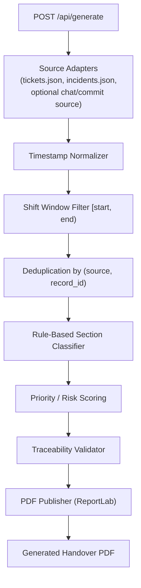

# 🔌 RISE-RST — Backend

<p>
  
  
  
  
  
</p>

FastAPI service that powers RISE-RST's shift handover generation pipeline: it loads activity from configured sources, restricts it to a shift's time window, deduplicates it, classifies it into sections, validates traceability, and publishes the result as a PDF.

---

## 📑 Table of Contents

- [🧩 Overview](#overview)
- [🏗️ Pipeline Architecture](#pipeline-architecture)
- [🛠️ Tech Stack](#tech-stack)
- [📁 Project Structure](#project-structure)
- [🚀 Setup](#setup)
- [▶️ Running the Service](#running-the-service)
- [📡 API](#api)
- [🕒 Shift Window Logic](#shift-window-logic)
- [🔗 Traceability](#traceability)
- [🧪 Testing](#testing)
- [🗂️ Data Sources](#data-sources)
- [🔮 Future Enhancements](#future-enhancements)

---

## 🧩 Overview

The backend is the source of truth for handover generation. Given a shift start/end time and a set of sources, it produces a deterministic, fully-traceable set of classified items, then exports them as a single PDF. Nothing in the output is fabricated — every line is validated back to a real source record before it's included.

## 🏗️ Pipeline Architecture



| Stage | Responsibility |
|---|---|
| 📡 Source Adapters | Load raw activity records from each configured source |
| 🌐 Timestamp Normalizer | Normalize incoming timestamps to a consistent format/timezone |
| 🕒 Shift Window Filter | Keep only activity within `[shift_start, shift_end)` |
| 🧹 Deduplication | Fold multiple updates to the same `(source, record_id)` into one final state |
| 🏷️ Classifier | Deterministically assign each item to Completed / In Progress / Blockers-Escalations / Watch-list |
| ⚠️ Risk Scoring | Route ambiguous or high-severity items into the correct section |
| 🔗 Traceability Validator | Drop any item without a valid source + record ID |
| 📄 PDF Publisher | Render the validated, classified result as a single PDF |

## 🛠️ Tech Stack

| Layer | Technology |
|---|---|
| 🚀 Framework | FastAPI |
| 🧬 Validation | Pydantic |
| 🦄 ASGI Server | Uvicorn |
| 📑 PDF Export | ReportLab |
| 🖼️ Imaging | Pillow |
| 📅 Date Handling | python-dateutil |
| 🌐 ASGI Toolkit | Starlette, Anyio |

## 📁 Project Structure

```
backend/
├── app/
│   └── main.py          # FastAPI entry point (app.main:app)
├── requirements.txt      # Python dependencies
└── .env.example           # Environment variable template
```

> Structured around `app.main:app`, with services for source loading, normalization, window filtering, deduplication, classification, risk scoring, traceability validation, and PDF publishing, per the documented architecture.

## 🚀 Setup

### ✅ Prerequisites

- 🐍 Python 3.x with `venv`

### 🔧 Install

```bash
cd backend
python -m venv venv
source venv/bin/activate      # On Windows: venv\Scripts\activate
pip install -r requirements.txt
cp .env.example .env
```

## ▶️ Running the Service

```bash
cd backend
uvicorn app.main:app --reload
```

The API will be available at `http://localhost:8000` by default (see Uvicorn output for the exact host/port).

## 📡 API

### `POST /api/generate`

Generates a handover for a given shift window and set of sources.

- **Input:** shift start/end time, selected data sources
- **Process:** runs the full pipeline above (load → normalize → filter → dedupe → classify → score → validate → publish)
- **Output:** a generated handover PDF, with items grouped into the four fixed sections; empty sections are returned as "Nothing to report" rather than omitted

## 🕒 Shift Window Logic

Activity is scoped with a half-open interval:

```
shift_start <= timestamp < shift_end
```

This keeps stale backlog items out of a handover and removes ambiguity about which shift owns an activity landing exactly on a boundary timestamp. Anything outside the selected window is excluded from generation entirely.

## 🔗 Traceability

Every classified item must carry a valid **source name**, **record ID**, and **timestamp**. The traceability validation stage enforces this by dropping any item that can't be tied back to a real source record — nothing ungrounded reaches the PDF.

## 🧪 Testing

A manual test matrix (documented in `REPORT.md`) covers:

- A quiet shift
- A busy shift
- Duplicate ticket updates
- Boundary timestamps
- A zero-event shift
- Malformed/unavailable sources
- Reproducibility (regenerating the same shift twice and comparing item/section counts)

No automated test-runner (e.g. `pytest`) is currently confirmed in the repo — automated regression tests for boundary timestamps, duplicates, and malformed input are tracked under [Future Enhancements](#future-enhancements).

## 🗂️ Data Sources

Current sources are **JSON-based seeded data** (tickets, incidents). Malformed or unavailable sources are logged and skipped rather than crashing generation.

## 🔮 Future Enhancements

- 🔗 Live **Jira / Trello / GitHub / Slack** adapters with read-only scoped authentication
- ⏪ **Carry-forward logic** for unresolved items from the previous shift
- 🩺 A **source-health panel** with per-source ingestion statistics
- 💬 **Slack-postable / Markdown export**, alongside PDF
- ⚙️ **Config-driven status mappings** for connecting new sources without code changes
- 🧪 **Automated regression tests** for boundary timestamps, duplicates, and malformed input
- 🤖 Optional **AI-assisted summary** generation (scoped to never invent section items; disabled when no approved API key is available)
- 🔐 User **authentication** and **database-backed** persistence
- 🔔 **Notifications** for handover completion or unresolved blockers
